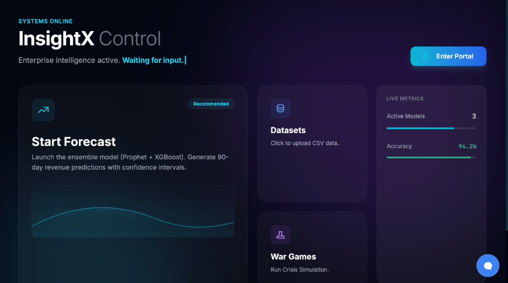
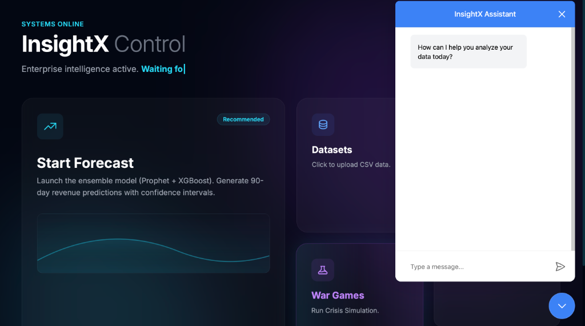
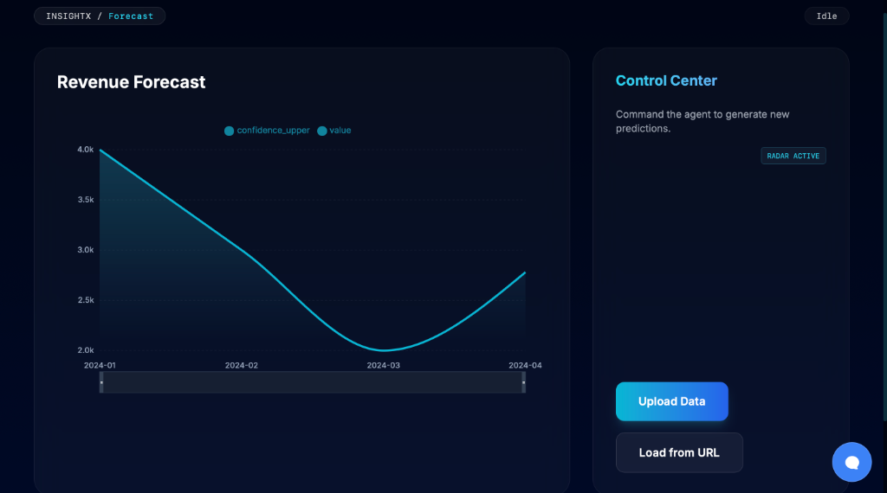
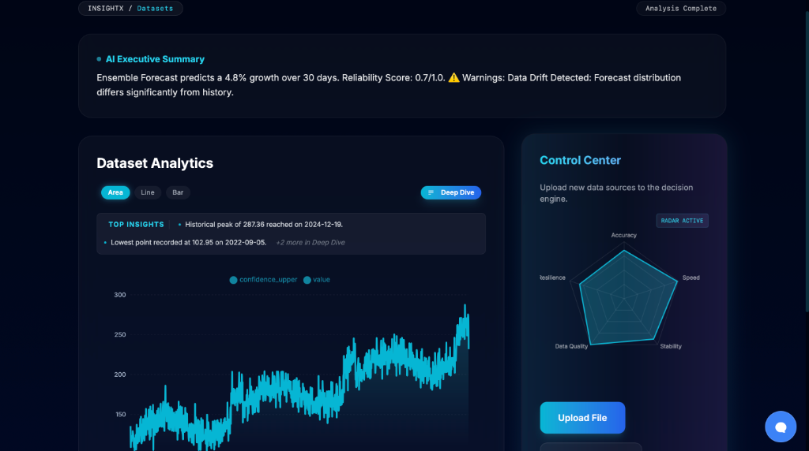
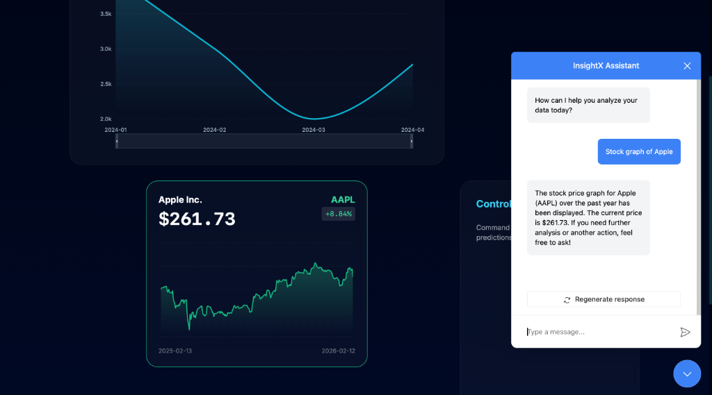
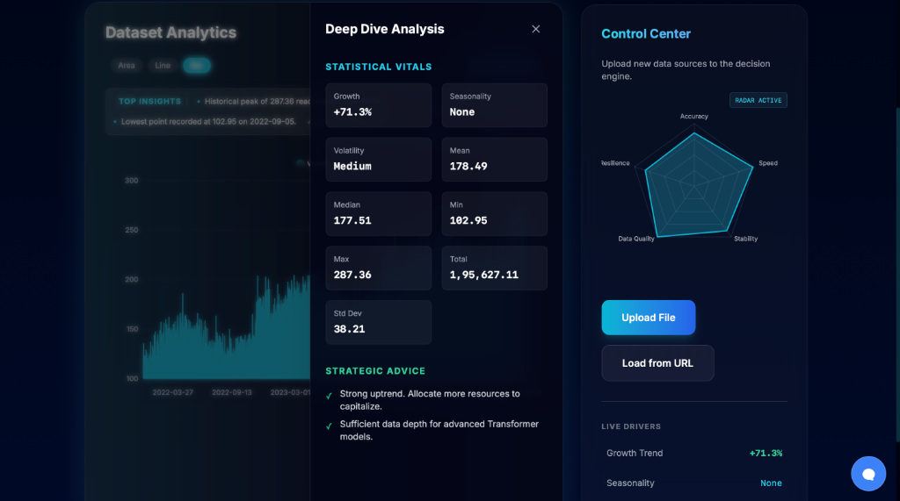

# InsightX: Enterprise Forecasting & Intelligence Platform
   

## 🚀 Overview

**InsightX** is an advanced AI-powered analytics dashboard designed to transform raw business data into actionable strategic intelligence. Unlike traditional BI tools that simply *show* data, InsightX *interprets* it, forecasts future trends, and simulates crisis scenarios to help businesses prepare for the unknown.

### ✨ Key Differentiators (Why InsightX?)
*   **🧠 "War Games" Simulation:** A unique feature that stress-tests your business model against real-world crises (Recession, Inflation, Supply Chain Shocks). It doesn't just predict; it prepares.
*   **🔮 Ensemble Forecasting:** Uses a weighted blend of **Prophet**, **XGBoost**, and **ARIMA** models to generate highly accurate revenue predictions with confidence intervals.
*   **💬 AI Analyst Agent:** A built-in Copilot based on the **A2UI Protocol** that can generate charts, answer complex queries, and navigate the dashboard via natural language.

---

## 🛠️ Tech Stack & Tools

### Backend (The Brain)
*   **FastAPI & Python:** High-performance async API handling data processing and model inference.
*   **Machine Learning:** `Prophet`, `XGBoost`, `Statsmodels` (ARIMA/STL) for time-series forecasting and anomaly detection.
*   **Data Processing:** `Pandas`, `NumPy` for aggressive data cleaning and normalization.
*   **Infrastructure:** `Docker`, `Docker Compose`, `Redis` (for task queues and pub/sub).

### Frontend (The Interface)
*   **Next.js 14 (App Router):** Server-side rendering for optimal performance and SEO.
*   **TypeScript & Tailwind CSS:** Type-safe development with a modern, "glassmorphism" aesthetic.
*   **Visualization:** `Recharts` for interactive, responsive data plotting.
*   **AI Integration:** `CopilotKit` for embedding the context-aware AI assistant.

---

## 💡 Features in Detail

### 1. **Robust Data Ingestion**
*   **Challenge:** Users often upload messy CSVs with weird formatting, currency symbols (`$1,000.00`), or missing headers.
*   **Solution:** Implemented an aggressive preprocessing pipeline that:
    *   Automatically detects date columns using fuzzy matching.
    *   Strips non-numeric characters from value columns.
    *   Smartly identifies the target variable (e.g., prioritizing "Sales", "Revenue", "Profit").
    *   Handles missing data with forward-fill interpolation.

### 2. **Interactive "War Games"** 📉
*   **Challenge:** Static forecasts are often overly optimistic and fail to account for black swan events.
*   **Solution:** Built a dynamic simulation engine that applies negative coefficients to the forecast based on economic theory (e.g., Inflation = purchasing power decline).
*   **Outcome:** Users can toggle scenarios in real-time and visualize the precise revenue impact of a global recession or supply chain collapse.

### 3. **Smart Visualization** 📊
*   **Challenge:** Graphs are often cluttered and hard to read.
*   **Solution:** Designed a "Smart Chart" component that:
    *   Dynamically formats axes (e.g., "Jan 01" instead of raw timestamps).
    *   Includes a custom tooltip for precise data lookup.
    *   Visualizes confidence intervals (P10/P90) to show uncertainty.

---

## 🚧 Challenges & Solutions

| Challenge | Solution |
| :--- | :--- |
| **"Upload Failed" Errors** | Debugged `UnboundLocalError` in the analysis pipeline by restructuring the scope of narrative generation variables. Added fallback logic for datasets with no numeric columns. |
| **Docker Networking** | Fixed cross-container communication issues (Backend <-> DB) by ensuring all services shared a custom bridge network and using service names as hostnames. |
| **Real-time Updates** | Implemented Redis Pub/Sub to stream forecasting progress (0% -> 100%) to the frontend, preventing HTTP timeouts on long-running ML tasks. |

---

## 📸 Screenshots

|  |  |
| :---: | :---: |
| **Control Center** | **AI Analyst** |

|  |  |
| :---: | :---: |
| **Ensemble Forecast** | **Dataset Analytics** |

<p align="center">
  
  <br>
  <em>Deep Dive Analytics</em>
</p>

## 🤖 AI & Insights

|  |  |
| :---: | :---: |
| **Copilot Stock Analysis** | **Statistical Deep Dive** |

## 📦 How to Run

### Prerequisites
*   Docker & Docker Compose
*   Make (optional)

### Quick Start
```bash
# 1. Clone the repository
git clone https://github.com/Sur27codes/Insight-X.git
cd Insight-X

# 2. Start the application (Backend + Frontend + DB)
docker-compose up --build

# 3. Access the dashboard
# Frontend: http://localhost:3000
# Backend API: http://localhost:8000/docs
```

---

## 👨‍💻 Author
**Survaghasiya**  
*Building intelligent systems that solve real problems.*
